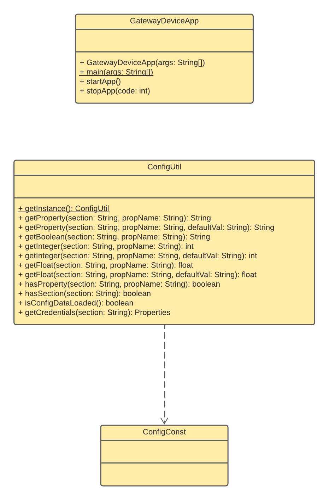

# Gateway Device Application (Connected Devices)

## Lab Module 01

Be sure to implement all the PIOT-GDA-* issues (requirements) listed at [PIOT-INF-01-001 - Chapter 01](https://github.com/orgs/programming-the-iot/projects/1#column-9974937).

### Description

Module01:Gateway Device Application is used to check if GDA development environment was built successfully and to help us practice using GitHub Classroom and git commands to manage repositories and branches. The implementation showed the structure of GDA projects with the project from repository. 

The implementation contains following steps:
1. Install eclipse and Java environment.
2. Clone and import online repository from GitHub Classroom
3. Create a new branch and edit pom.xml.
4. Run unit tests and integration tests.(From ConfigUtilTest.java and GatewayDeviceAppTest.java)
5. Observe the result of tests.
6. Merge 2 branched and push to online repository. 

### Code Repository and Branch

URL: https://github.com/NU-CSYE6530-Fall2020/gateway-device-app-Zhengrui-Liu/tree/chapter01

### UML Design Diagram(s)

### Unit Tests Executed

- piot-java-components/src/test/java/programmingtheiot/part01/unit/common/ConfigUtilTest.java

### Integration Tests Executed

- piot-java-components/src/test/java/programmingtheiot/part01/integration/app/GatewayDeviceAppTest.java
