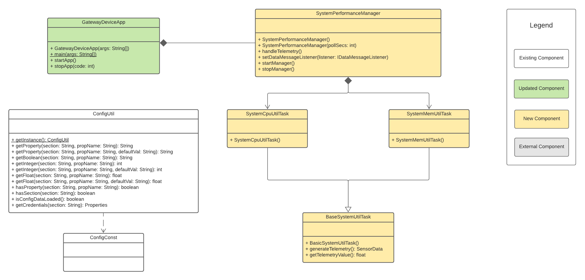

# Gateway Device Application (Connected Devices)

## Lab Module 02

Be sure to implement all the PIOT-GDA-* issues (requirements) listed at [PIOT-INF-02-001 - Chapter 02](https://github.com/orgs/programming-the-iot/projects/1#column-9974938).

### Description

Build and test a simple IoT Edge Tier application. Implemented GDA in Java. Implemented two Edge Tier functionality. The functionalities are reading and reporting CPU utilization and Memory utilization.  

I finished the tasks with the following steps:
1. Create and check out a new branch of the repository that is "chapter002".
2. Make sure each method is set in class GatewayDeviceApp and test it.
3. Make sure each method is set in class SystemPerformanceManager and add new log for start and stop method then test it.
4. Connect GatewayDeviceApp with SystemPerformanceManager.(Instantiate SystemPerformanceManager in GatewayDeviceApp and test it)
5. Create a variable in BaseSystemUtilTask to save utilization informations.
6. Edit class SystemCpuUtilTask and let it be able to get CPU utilization information then test it.
7. Edit class SystemMemUtilTask and let it be able to get Memory utilization information then test it.
8. Instantiate SystemMemUtilTask and SystemCpuUtilTask in SystemPerformanceManager then test SystemPerformanceManager. 

### Code Repository and Branch

URL: https://github.com/NU-CSYE6530-Fall2020/gateway-device-app-Zhengrui-Liu/tree/chapter02

### UML Design Diagram(s)

### Unit Tests Executed

- poit-java-components/src/test/java/programmingtheiot/part01/integration/app/GatewayDeviceAppTest.java
- poit-java-components/src/test/java/programmingtheiot/part01/integration/system/SystemPerformanceManagerTest.java

### Integration Tests Executed

- poit-java-components/src/test/java/programmingtheiot/part01/unit/system/SystemCpuUtilTaskTest.java
- poit-java-components/src/test/java/programmingtheiot/part01/unit/system/SystemMemUtilTaskTest.java

