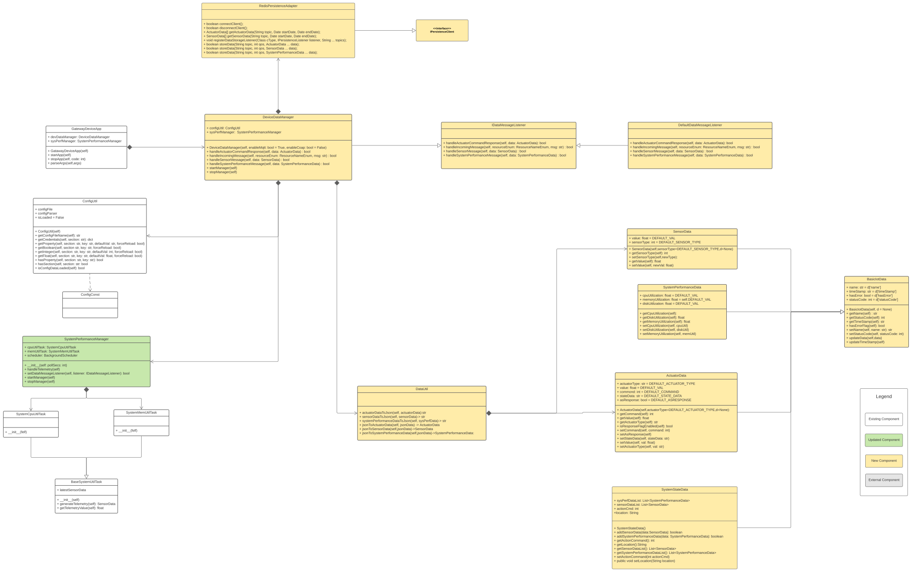

# Gateway Device Application (Connected Devices)

## Lab Module 05

Be sure to implement all the PIOT-GDA-* issues (requirements) listed at [PIOT-INF-01-001 - Chapter 01](https://github.com/orgs/programming-the-iot/projects/1#column-9974937).

### Description

Build DDM and all data class, then implement convert method between data and Json.

1.Create / update data containers for sensor and actuator data

2.Create / edit module - DataUtil

3.Add functionality to BaseSystemUtilTask implementation

4.Create / edit the module - DeviceDataManager

5.Connect DeviceDataManager to GatewayDeviceApp

### Code Repository and Branch

URL: https://github.com/NU-CSYE6530-Fall2020/gateway-device-app-Zhengrui-Liu/tree/chapter05

### UML Design Diagram(s)

### Unit Tests Executed

- piot-java-components/src/test/java/programmingtheiot/part01/unit/common/ConfigUtilTest.java
- piot-java-components/src/test/java/programmingtheiot/part01/unit/system/all
- piot-java-components/src/test/java/programmingtheiot/part02/unit/data/all

### Integration Tests Executed

- piot-java-components/src/test/java/programmingtheiot/part01/integration/app/GatewayDeviceAppTest.java
- piot-java-components/src/test/java/programmingtheiot/part02/integration/app/all
- piot-java-components/src/test/java/programmingtheiot/part02/integration/data/all