# Gateway Device Application (Gateway Devices)

## Lab Module 07

### Description

Implemented mqtt functions

1.Implemented publish,subscribe and unsubscribe functions.
2.Inplemented a simple version of callback functions.
3.Connected mqttClientConnector with DDM.

### Code Repository and Branch

URL: https://github.com/NU-CSYE6530-Fall2020/gateway-device-app-Zhengrui-Liu/tree/chapter07

### UML Design Diagram(s)

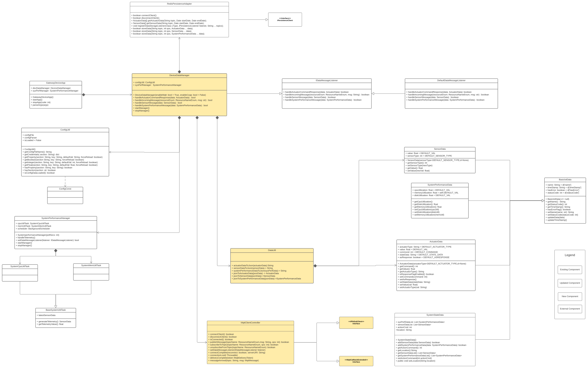

### Unit Tests Executed

- piot-java-components/src/test/java/programmingtheiot/part01/unit/common/ConfigUtilTest.java
- piot-java-components/src/test/java/programmingtheiot/part01/unit/system/all
- piot-java-components/src/test/java/programmingtheiot/part02/unit/data/all

### Integration Tests Executed

- piot-java-components/src/test/java/programmingtheiot/part01/integration/app/GatewayDeviceAppTest.java
- piot-java-components/src/test/java/programmingtheiot/part02/integration/app/all
- piot-java-components/src/test/java/programmingtheiot/part02/integration/data/all
- piot-java-components/src/test/java/programmingtheiot/part02/integration/connection/MqttCilentConnectorTest.java

### MQTT 14 Control Packets (QoS 1 and 2)

CONNECT

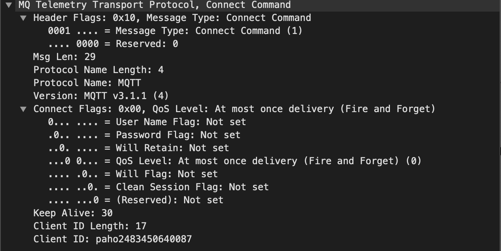

CONNACK

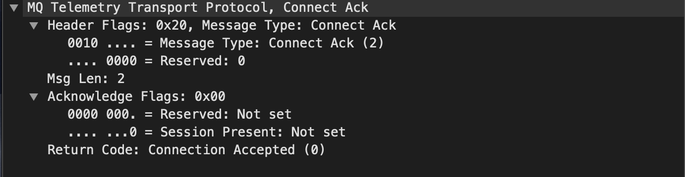

PUBLISH

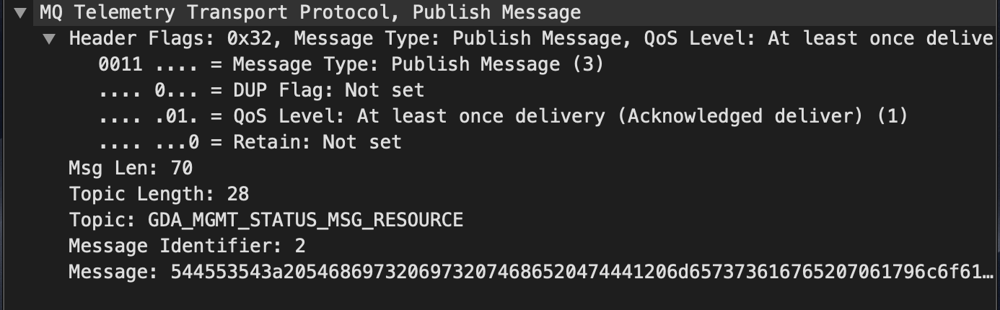

PUBACK(QoS1 only)

PUBREC(QoS2 only)

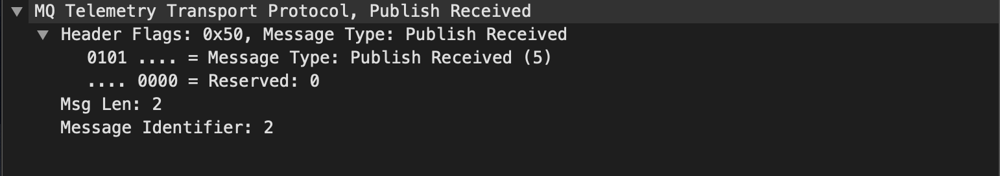

PUBREL(QoS2 only)

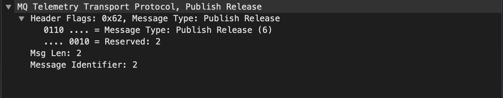

PUBCOMP(QoS2 only)

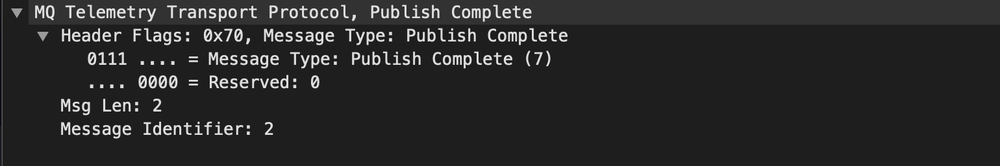

SUBSCRIBE

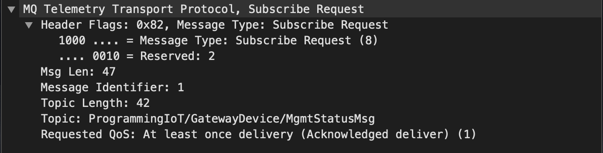

SUBACK

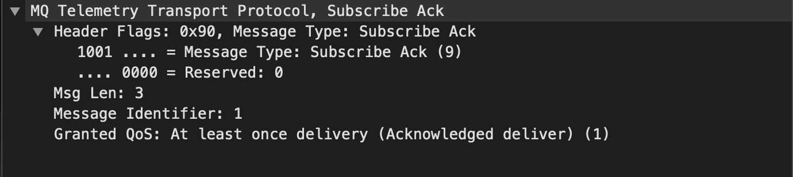

UNSUBSCRIBE

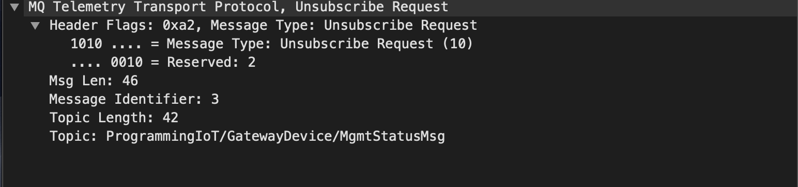

UNSUBACK

PINGREQ

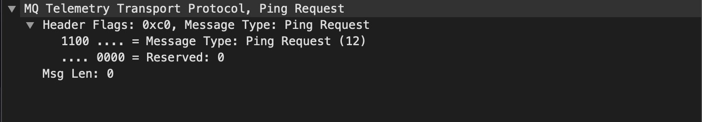

PINGRESP

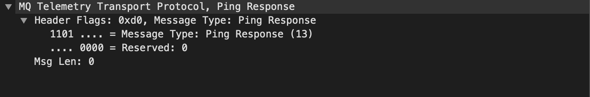

DISCONNECT

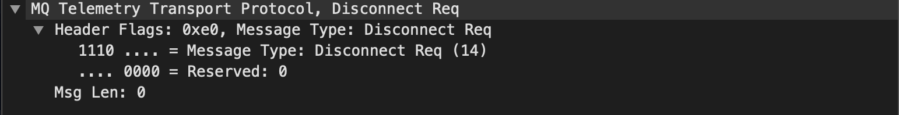