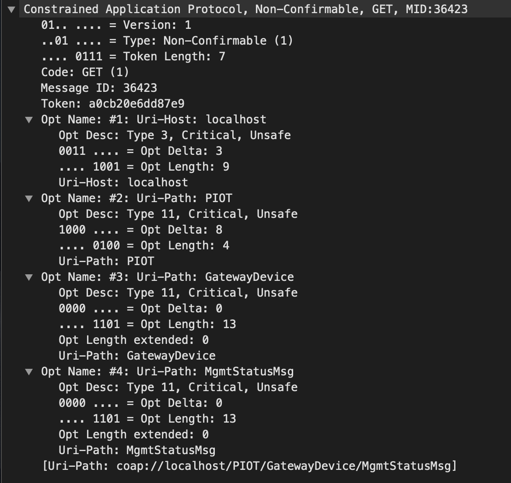

# Gateway Device Application (Gateway Devices)

## Lab Module 09

### Description

Implemented CoAP functions

1.Implemented CoAP Client.

### Code Repository and Branch

URL: https://github.com/NU-CSYE6530-Fall2020/gateway-device-app-Zhengrui-Liu/tree/chapter09

### UML Design Diagram(s)

### Unit Tests Executed

- piot-java-components/src/test/java/programmingtheiot/part01/unit/common/ConfigUtilTest.java
- piot-java-components/src/test/java/programmingtheiot/part01/unit/system/all
- piot-java-components/src/test/java/programmingtheiot/part02/unit/data/all

### Integration Tests Executed

- piot-java-components/src/test/java/programmingtheiot/part01/integration/app/GatewayDeviceAppTest.java
- piot-java-components/src/test/java/programmingtheiot/part02/integration/app/all
- piot-java-components/src/test/java/programmingtheiot/part02/integration/data/all
- piot-java-components/src/test/java/programmingtheiot/part02/integration/connection/MqttCilentConnectorTest.java
- piot-java-components/src/test/java/programmingtheiot/part02/integration/connection/CoapServerGatewayTest.java
- piot-java-components/src/test/java/programmingtheiot/part02/integration/connection/CoapClientConnectorTest.java

### CoAP packages captured

##### GET-CON

##### GET-NON

##### POST-CON

##### POST-NON

##### PUT-CON

##### PUT-NON

##### DELETE-CON

##### DELETE-NON

