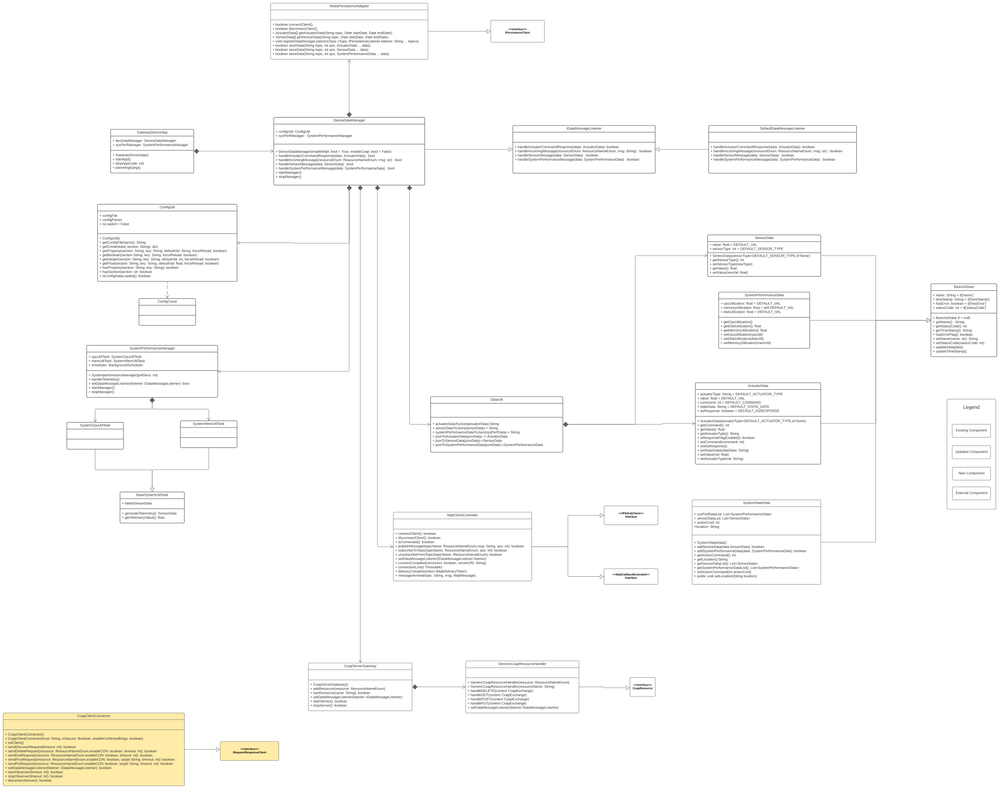

# Gateway Device Application (Gateway Devices)

## Lab Module 10

### Description

Integration

### Code Repository and Branch

URL: https://github.com/NU-CSYE6530-Fall2020/gateway-device-app-Zhengrui-Liu/tree/chapter09

### UML Design Diagram(s)

### Unit Tests Executed

- piot-java-components/src/test/java/programmingtheiot/part01/unit/common/ConfigUtilTest.java
- piot-java-components/src/test/java/programmingtheiot/part01/unit/system/all
- piot-java-components/src/test/java/programmingtheiot/part02/unit/data/all

### Integration Tests Executed

- piot-java-components/src/test/java/programmingtheiot/part01/integration/app/GatewayDeviceAppTest.java
- piot-java-components/src/test/java/programmingtheiot/part02/integration/app/all
- piot-java-components/src/test/java/programmingtheiot/part02/integration/data/all
- piot-java-components/src/test/java/programmingtheiot/part02/integration/connection/MqttCilentConnectorTest.java
- piot-java-components/src/test/java/programmingtheiot/part02/integration/connection/CoapServerGatewayTest.java
- piot-java-components/src/test/java/programmingtheiot/part02/integration/connection/CoapClientConnectorTest.java

### GDA MQTT Client Performance Test Results

#####QoS0

Connect time: 312 ms
Publish time: 3560 ms

Dec 02, 2020 2:49:14 PM programmingtheiot.gda.connection.MqttClientConnector connectClient
INFO: Client Connecting
Dec 02, 2020 2:49:14 PM programmingtheiot.gda.connection.MqttClientConnector connectComplete
INFO: connectComplete is called!
Dec 02, 2020 2:49:18 PM programmingtheiot.gda.connection.MqttClientConnector disconnectClient
INFO: Client Disconnecting
Dec 02, 2020 2:49:18 PM programmingtheiot.part03.integration.connection.MqttClientPerformanceTest execTestPublish
INFO: Publish message - QoS 0 [100000]: 3560 ms
Dec 02, 2020 2:49:18 PM programmingtheiot.gda.connection.MqttClientConnector connectClient
INFO: Client Connecting
Dec 02, 2020 2:49:18 PM programmingtheiot.gda.connection.MqttClientConnector connectComplete
INFO: connectComplete is called!
Dec 02, 2020 2:49:18 PM programmingtheiot.gda.connection.MqttClientConnector disconnectClient
INFO: Client Disconnecting
Dec 02, 2020 2:49:18 PM programmingtheiot.part03.integration.connection.MqttClientPerformanceTest testConnectAndDisconnect
INFO: Connect and Disconnect [1]: 312 ms
Dec 02, 2020 2:49:18 PM programmingtheiot.gda.connection.MqttClientConnector connectComplete
INFO: connectComplete is called!

#####QoS1

Connect time: 314 ms
Publish time: 7363 ms

Dec 02, 2020 2:52:13 PM programmingtheiot.gda.connection.MqttClientConnector connectClient
INFO: Client Connecting
Dec 02, 2020 2:52:13 PM programmingtheiot.gda.connection.MqttClientConnector connectComplete
INFO: connectComplete is called!
Dec 02, 2020 2:52:21 PM programmingtheiot.gda.connection.MqttClientConnector disconnectClient
INFO: Client Disconnecting
Dec 02, 2020 2:52:21 PM programmingtheiot.part03.integration.connection.MqttClientPerformanceTest execTestPublish
INFO: Publish message - QoS 1 [100000]: 7363 ms
Dec 02, 2020 2:52:21 PM programmingtheiot.gda.connection.MqttClientConnector connectClient
INFO: Client Connecting
Dec 02, 2020 2:52:21 PM programmingtheiot.gda.connection.MqttClientConnector connectComplete
INFO: connectComplete is called!
Dec 02, 2020 2:52:21 PM programmingtheiot.gda.connection.MqttClientConnector disconnectClient
INFO: Client Disconnecting
Dec 02, 2020 2:52:21 PM programmingtheiot.part03.integration.connection.MqttClientPerformanceTest testConnectAndDisconnect
INFO: Connect and Disconnect [1]: 314 ms
Dec 02, 2020 2:52:21 PM programmingtheiot.gda.connection.MqttClientConnector connectComplete
INFO: connectComplete is called!

#####QoS2

Connect time: 320 ms
Publish time: 10721 ms

Dec 02, 2020 2:53:21 PM programmingtheiot.gda.connection.MqttClientConnector connectClient
INFO: Client Connecting
Dec 02, 2020 2:53:22 PM programmingtheiot.gda.connection.MqttClientConnector connectComplete
INFO: connectComplete is called!
Dec 02, 2020 2:53:32 PM programmingtheiot.gda.connection.MqttClientConnector disconnectClient
INFO: Client Disconnecting
Dec 02, 2020 2:53:32 PM programmingtheiot.part03.integration.connection.MqttClientPerformanceTest execTestPublish
INFO: Publish message - QoS 2 [100000]: 10721 ms
Dec 02, 2020 2:53:32 PM programmingtheiot.gda.connection.MqttClientConnector connectClient
INFO: Client Connecting
Dec 02, 2020 2:53:33 PM programmingtheiot.gda.connection.MqttClientConnector connectComplete
INFO: connectComplete is called!
Dec 02, 2020 2:53:33 PM programmingtheiot.gda.connection.MqttClientConnector disconnectClient
INFO: Client Disconnecting
Dec 02, 2020 2:53:33 PM programmingtheiot.part03.integration.connection.MqttClientPerformanceTest testConnectAndDisconnect
INFO: Connect and Disconnect [1]: 320 ms
Dec 02, 2020 2:53:33 PM programmingtheiot.gda.connection.MqttClientConnector connectComplete
INFO: connectComplete is called!

#####Result

Run time: QoS0 < QoS1 < QoS2
Connect time: same

### GDA COAP Client Performance Test Results

##### CON

Dec 03, 2020 6:25:09 PM org.eclipse.californium.core.network.config.NetworkConfig createStandardWithFile
INFO: Loading standard properties from file Californium.properties
Dec 03, 2020 6:25:09 PM programmingtheiot.gda.connection.CoapClientConnector initClient
INFO: Created client connection to server / resource: coap://localhost:5683
Dec 03, 2020 6:25:09 PM programmingtheiot.gda.connection.CoapClientConnector <init>
INFO: Using URL for server conn: coap://localhost:5683
Dec 03, 2020 6:25:10 PM org.eclipse.californium.core.network.CoapEndpoint start
INFO: Starting endpoint at 0.0.0.0/0.0.0.0:0
Dec 03, 2020 6:25:10 PM org.eclipse.californium.core.network.EndpointManager createDefaultEndpoint
INFO: Created implicit default endpoint 0.0.0.0/0.0.0.0:59241
Dec 03, 2020 6:25:10 PM programmingtheiot.part03.integration.connection.CoapClientPerformanceTest execTestPost
INFO: POST message - useCON true [10000]: 525 ms

##### NON

Dec 03, 2020 6:26:10 PM org.eclipse.californium.core.network.config.NetworkConfig createStandardWithFile
INFO: Loading standard properties from file Californium.properties
Dec 03, 2020 6:26:10 PM programmingtheiot.gda.connection.CoapClientConnector initClient
INFO: Created client connection to server / resource: coap://localhost:5683
Dec 03, 2020 6:26:10 PM programmingtheiot.gda.connection.CoapClientConnector <init>
INFO: Using URL for server conn: coap://localhost:5683
Dec 03, 2020 6:26:11 PM org.eclipse.californium.core.network.CoapEndpoint start
INFO: Starting endpoint at 0.0.0.0/0.0.0.0:0
Dec 03, 2020 6:26:11 PM org.eclipse.californium.core.network.EndpointManager createDefaultEndpoint
INFO: Created implicit default endpoint 0.0.0.0/0.0.0.0:64159
Dec 03, 2020 6:26:11 PM programmingtheiot.part03.integration.connection.CoapClientPerformanceTest execTestPost
INFO: POST message - useCON false [10000]: 287 ms

##### Result

Run Time: NON < CON
