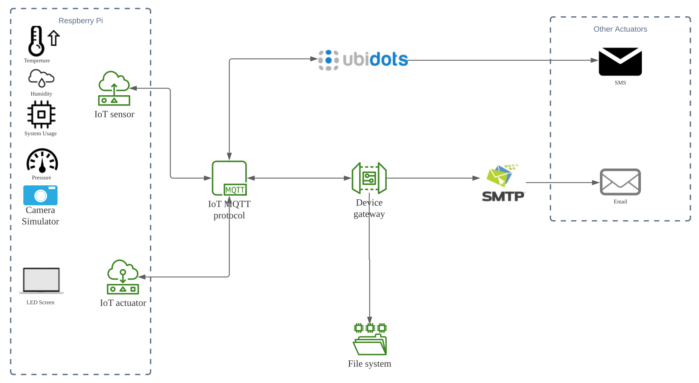
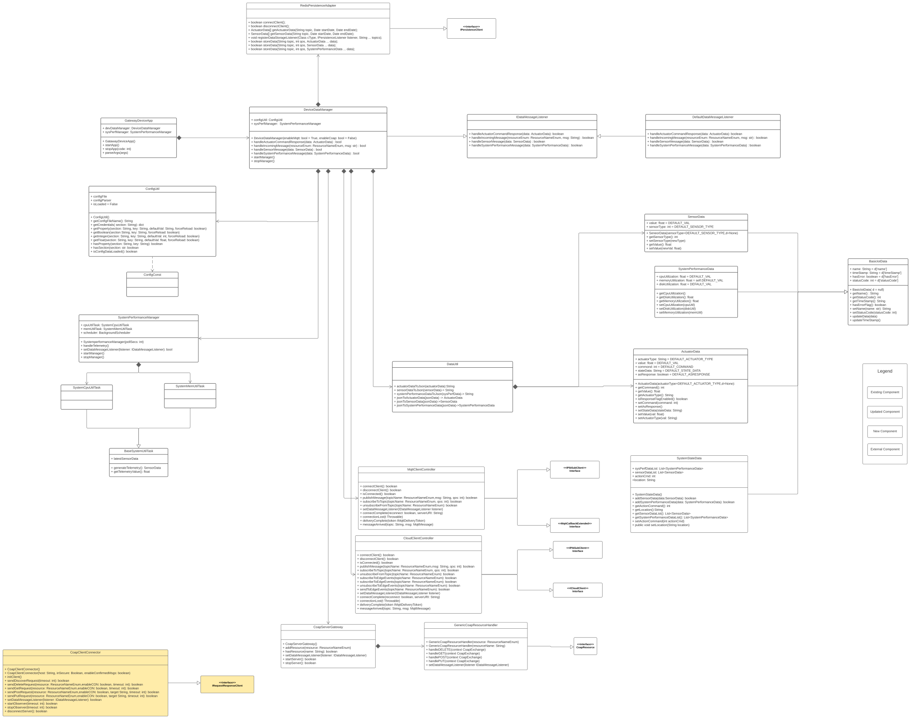

# Gateway Device Application (Gateway Devices)

## Lab Module 12 - Semester Project - GDA Components

Be sure to implement all the PIOT-GDA-* issues (requirements) listed at [PIOT-INF-11-001 - Chapter 11](https://github.com/orgs/programming-the-iot/projects/1#column-10488514).

### Description

NOTE: Include two full paragraphs describing your implementation approach by answering the questions listed below.

It is a Gateway Device application of a fire alarming system, it connects ubidots cloud and Constrained Device application with Mqtt protocol.

The gateway Device can:
	1. Receive sensor data and system performance data from Constrained Device and pass them to cloud
	2. Trigger an actuation of Humidifier
	3. Pass actuation request for pressure actuator from cloud
 	4. Send email with a picture to users' email
 	5. receive pictures from Constrained Device
 	6. Generate system performance data and pass it to cloud

### Code Repository and Branch

URL: https://github.com/NU-CSYE6530-Fall2020/gateway-device-app-Zhengrui-Liu/tree/chapter11

### UML Design Diagram(s)

### Unit Tests Executed

- piot-java-components/src/test/java/programmingtheiot/part01/unit/common/ConfigUtilTest.java
- piot-java-components/src/test/java/programmingtheiot/part01/unit/system/all
- piot-java-components/src/test/java/programmingtheiot/part02/unit/data/all
- piot-java-components/src/test/java/programmingtheiot/part03/unit/connection/all

### Integration Tests Executed

- piot-java-components/src/test/java/programmingtheiot/part01/integration/app/all
- piot-java-components/src/test/java/programmingtheiot/part01/integration/system/all
- piot-java-components/src/test/java/programmingtheiot/part02/integration/app/all
- piot-java-components/src/test/java/programmingtheiot/part02/integration/data/all
- piot-java-components/src/test/java/programmingtheiot/part02/integration/connection/all
- piot-java-components/src/test/java/programmingtheiot/part03/integration/connection/all
- piot-java-components/src/test/java/programmingtheiot/part03/integration/app/all
- piot-java-components/src/test/java/programmingtheiot/part04/integration/connection/all

### Logs

The log for 1 hour test is in the same folder

1. sensordata.csv : The sensor data sent in 1 hour
2. actuatordata.csv : The actuator data sent in 1 hour (excludes temperature)
3. systemperformancedataCDA.csv : The system performance data of CDA in 1 hour
4. systemperformancedataGDA.csv : The system performance data of GDA in 1 hour
